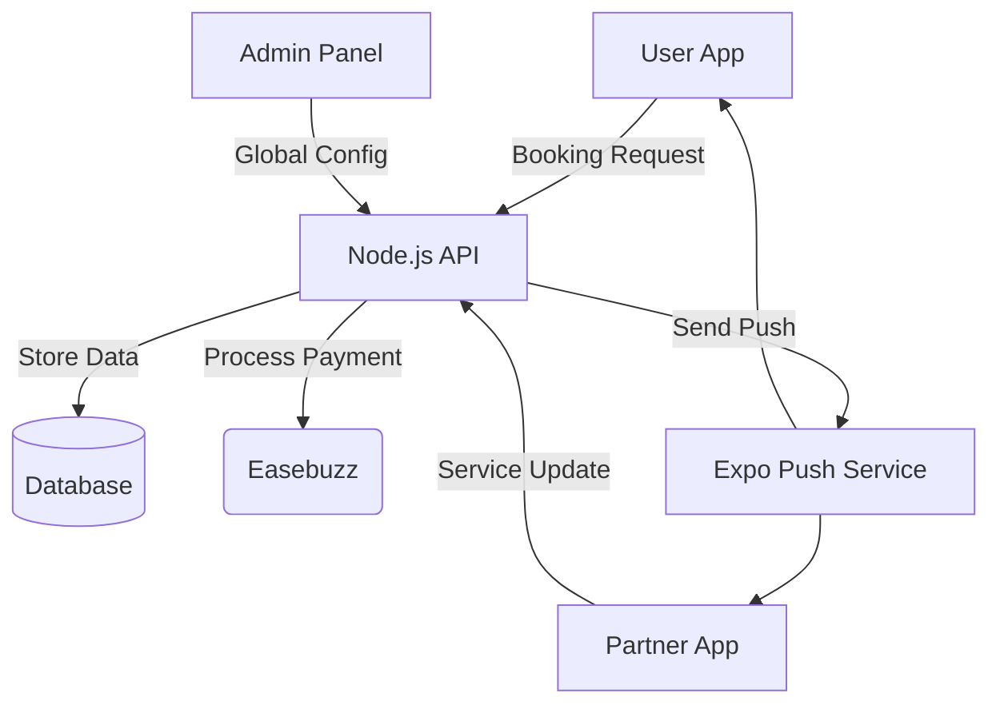

# A1Care Management: Detailed Project & Flow Documentation

This document provides a deep dive into the business logic, data flow, and architectural patterns of the A1Care platform.

## 🔄 Core Business Flows

### 1. The Booking Lifecycle (User Perspective)
*   **Discovery**: Users browse services (on-demand/center-based) or doctors through the **User App**.
*   **Selection & Validation**: When a user selects a doctor or service, the app hits the `Bookings` or `Doctors` modules in the backend. 
    *   *Logic*: The system checks for availability and calculates the base price + platform fees.
*   **Payment & Wallet Integration**: 
    *   Users can pay via **Online** (gateway integration via `Wallet` module) or **Wallet Balance**.
    *   The `doctorAppointment.controller.ts` handles the validation of funds and creates a pending state.
*   **Confirmation & Notification**: Once paid, a push notification is triggered (`sendPushNotification.ts`) to both the User and the Partner.

### 2. The Partner Workflow (Provider Perspective)
*   **Onboarding**: Partners must subscribe to a plan (`PartnerSubscription` module) before they can list services or accept appointments.
*   **Management**: Using the **Partner App**, providers track upcoming visits, update task statuses, and manage their earnings in their partner wallet.
*   **Service Fulfillment**: Partners update booking statuses (e.g., "Accepted", "In Progress", "Completed"), which triggers live updates in the User App.

### 3. Administrative Control (Admin Perspective)
*   **System Oversight**: Admins use the **Admin Panel** (managed via `AdminManagementPage` and `SystemSettingsPage`) to monitor system health.
*   **Financial Oversight**: Managing `SubscriptionManagementPage` to ensure partners are active and paid.
*   **Conflict Resolution**: Handling support tickets via `TicketsPage` linked to the `Tickets` backend module.
*   **Operations**: Managing specific booking types through `OPBookingsPage` and `BookingOperationsPage`.

---

## 🛠 Project Structure Breakdown (In-Depth)

### 📂 `a1care backend/` (API Server)
*   **Architecture**: Controller-Model-Route pattern segmented by modules.
*   **Key Modules (`src/modules/`)**:
    *   `Bookings/`: Heavy logic for `doctorAppointment`, `hospitalBooking`, and `serviceBooking`. Contains Zod/Express validation.
    *   `Wallet/`: Handles financial transactions, Easebuzz integration (`easebuzz.utils.ts`), and transaction history.
    *   `Authentication/`: Multi-role login logic with JWT protection Middleware.
    *   `Notifications/`: Centralized logic for Expo Push Notifications.
*   **Cross-Cutting Concerns**: Found in `src/utils/` (Email, SMS, S3 storage, and Global Error Handlers).

### 📂 `admin pannel/` (Operations Center)
*   **Pattern**: Single Page Application (SPA) with feature-based routing.
*   **Strategic Pages (`src/pages/`)**:
    *   `DoctorStaffManagementPage.tsx`: Managing the supply side of the platform.
    *   `ServiceManagementPage.tsx`: CRUD for healthcare services and pricing categories.
    *   `UserManagementPage.tsx`: Managing the demand side (investigating user profiles and bans).
*   **State Management**: Uses `React Query` for server state, ensuring UI syncs perfectly with the backend database.

### 📂 `user app/` (Customer Experience)
*   **Navigation**: Tree-based routing using `expo-router`.
    *   `(tabs)/`: Home dashboard, Services, Bookings, and Profile.
    *   `doctor/`, `hospital/`, `service/`: Dedicated flows for specific booking types.
*   **Persistence**: Uses `expo-secure-store` for sensitive auth tokens and `AsyncStorage` for user preferences.

---

## 🔐 Security & Data Patterns
- **RBAC (Role-Based Access Control)**: Strictly enforced. Users cannot access Partner endpoints, and only Admins can hit the `modules/Admin` routes.
- **Validation**: Strict schema validation on the backend ensures data integrity before it reaches the MongoDB/Database layer.
- **Environment Management**: Segmented keys for AWS, Payment Gateways, and Expo are managed via `.env` on backend and `app.json` for mobile.

---

## � Data Flow Diagram (Conceptual)

---

## � Developer Notes for New AI
- **Modifying Bookings**: Always check the specific controller in `a1care backend/src/modules/Bookings/` as logic differs between Doctors and General Services.
- **UI Consistency**: The Admin panel uses React 19; ensure any new components adhere to the hydration patterns of the latest React version.
- **Notifications**: Test push notifications via the `sendPushNotification.ts` utility; it requires a valid Expo Push Token.
